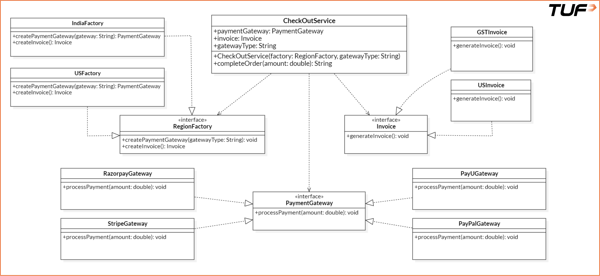

# Abstract Factory Pattern

> **One-liner:** A **factory of factories** — provide an interface to create **families of related objects** that must work together, without naming their concrete classes.

**Trigger phrase:** "I don't need *one* object, I need a **matching set** that must stay consistent (a payment gateway **and** its invoice; a button **and** its checkbox) — and which set depends on **context** (region/theme/OS). **One factory per family.**"

> **Load-bearing idea:** Factory makes **one product**; Abstract Factory makes a **whole family** (`createPaymentGateway()` + `createInvoice()` on the *same* factory) → guarantees the products are **compatible** (India gateway always paired with a GST invoice).

---

## Core Idea

The **Abstract Factory** defines an interface with **several create-methods**, one per product in a family. Each **concrete factory** produces the variant for its context. The client codes only to the abstract factory + product interfaces — it never sees a concrete class. Use it when:
- multiple related objects must be created **as a cohesive set**,
- the variant depends on **context** (country, theme, platform),
- you must **enforce consistency** across the family (no US gateway with an Indian invoice).

### Real-life analogy
**Regional checkout.** "Give me the **India** kit" → you get Razorpay/PayU **+** a GST invoice. "Give me the **US** kit" → PayPal/Stripe **+** a US invoice. You ask the regional factory; it hands you a matched set.

---

## ⭐ Canonical solution

```java
// ---- Product interfaces (the family) ----
interface PaymentGateway { void processPayment(double amount); }
interface Invoice        { void generateInvoice(); }

// ---- India variants ----
class RazorpayGateway implements PaymentGateway { public void processPayment(double a){ /*INR*/ } }
class PayUGateway     implements PaymentGateway { public void processPayment(double a){ /*INR*/ } }
class GSTInvoice      implements Invoice        { public void generateInvoice(){ /*GST*/ } }
// ---- US variants ----
class PayPalGateway implements PaymentGateway { public void processPayment(double a){ /*USD*/ } }
class StripeGateway implements PaymentGateway { public void processPayment(double a){ /*USD*/ } }
class USInvoice     implements Invoice        { public void generateInvoice(){ /*US*/ } }

// ---- Abstract Factory: one create-method per product in the family ----
interface RegionFactory {
    PaymentGateway createPaymentGateway(String gatewayType);
    Invoice        createInvoice();
}

// ---- Concrete factories: each builds ONE consistent family ----
class IndiaFactory implements RegionFactory {
    public PaymentGateway createPaymentGateway(String t){
        if (t.equalsIgnoreCase("razorpay")) return new RazorpayGateway();
        if (t.equalsIgnoreCase("payu"))     return new PayUGateway();
        throw new IllegalArgumentException("Unsupported gateway for India: " + t);
    }
    public Invoice createInvoice(){ return new GSTInvoice(); }   // India always → GST
}
class USFactory implements RegionFactory {
    public PaymentGateway createPaymentGateway(String t){
        if (t.equalsIgnoreCase("paypal")) return new PayPalGateway();
        if (t.equalsIgnoreCase("stripe")) return new StripeGateway();
        throw new IllegalArgumentException("Unsupported gateway for US: " + t);
    }
    public Invoice createInvoice(){ return new USInvoice(); }    // US always → US invoice
}

// ---- Client: depends only on the abstractions ----
class CheckoutService {
    private final PaymentGateway gateway;
    private final Invoice invoice;
    CheckoutService(RegionFactory f, String gatewayType){
        this.gateway = f.createPaymentGateway(gatewayType);     // family stays consistent
        this.invoice = f.createInvoice();
    }
    void completeOrder(double amount){ gateway.processPayment(amount); invoice.generateInvoice(); }
}
// usage: new CheckoutService(new IndiaFactory(), "razorpay").completeOrder(1999);
//        new CheckoutService(new USFactory(),    "paypal" ).completeOrder(49.99);
```

Adding a new region = **add one factory**; `CheckoutService` never changes (**OCP + DIP**).

---

## Class Diagram



```
RegionFactory (interface)            ← IndiaFactory, USFactory  realize it
  + createPaymentGateway(type): PaymentGateway
  + createInvoice(): Invoice

PaymentGateway (interface)  ← Razorpay, PayU, Stripe, PayPal  realize it
Invoice        (interface)  ← GSTInvoice, USInvoice           realize it

CheckOutService ──depends──▶ RegionFactory, PaymentGateway, Invoice   (abstractions only)
IndiaFactory / USFactory ──create──▶ the concrete products of their family
```
- Concrete factories **realize** `RegionFactory` (dashed + hollow triangle).
- Each concrete product **realizes** its product interface.
- `CheckOutService` has a **dependency** on the three *interfaces* — never on a concrete class (that's the decoupling). See [[3. UML]] for notations.

---

## Pros & Cons

**Pros:**
- **Family consistency** — products from one factory are guaranteed to fit together.
- **Encapsulates creation** — client is free of `new` and concrete names.
- **Scalable / OCP** — new family = new factory, no edits to existing code.
- **Testable** — swap in a mock factory; follows **DIP**.

**Cons:**
- **Hard to add a new *product* to the family** — every factory interface + all implementations must change (the classic Abstract Factory weakness).
- **Lots of boilerplate** — many interfaces/classes; overkill for simple cases.
- **Variant chosen at compile/wire time** — dynamic runtime switching is clumsier.

---

## Family / Related

- **Factory vs Abstract Factory:** [[3. Factory Pattern]] = one method → **one product**; Abstract Factory = a factory → **a family of related products**. Abstract Factory is often *implemented with* several factory methods.
- Pairs with [[4. Builder Pattern]] (a concrete factory may *build* a complex product) and rests on [[2. SOLID Principles]] — especially **OCP** and **DIP**.

---

## Pitfalls / Things to Remember

- **It's about *families*, not a single object.** If you only ever create one product type, you want plain **Factory**, not Abstract Factory.
- **Adding a product is expensive** — every factory must implement the new create-method. Easy to add *families*, hard to add *members*. Know this trade-off for interviews.
- **Don't leak concretes** — return the product *interface*; returning `RazorpayGateway` re-couples the client.
- **Throw on unknown input** inside the create-method, don't return `null`.
- **Don't over-apply** — the boilerplate only pays off with real, multiplying families.

*Prev:* [[4. Builder Pattern]] · *Next:* [[6. Prototype Pattern]]
