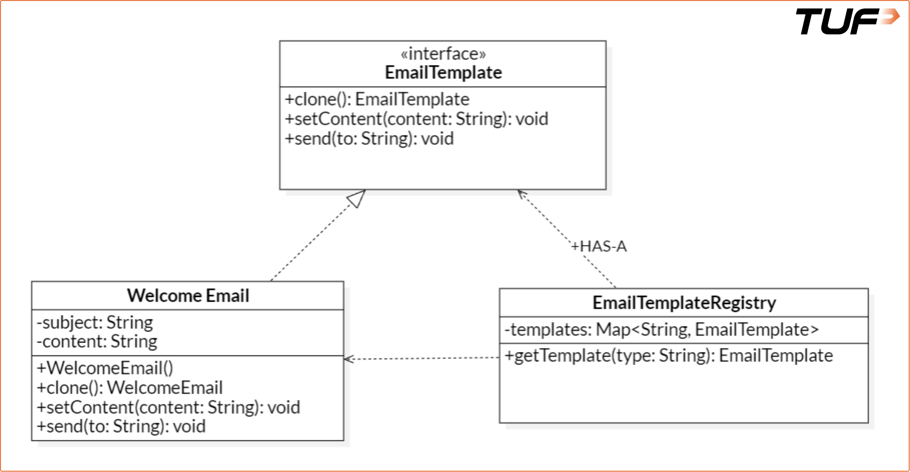

# Prototype Pattern

> **One-liner:** Create new objects by **cloning an existing configured one** (`clone()`) instead of building from scratch — copy + tweak a few fields.

**Trigger phrase:** "Setup is **expensive/complex** (load template, configs, user settings) and I need **many near-identical objects** with small variations → I'm calling `new X()` then a pile of setters every time. **Clone a prototype instead.**"

> **Load-bearing idea:** the object knows how to copy **itself** via `clone()`; the client gets a fresh, independent instance **without knowing its concrete class** or rerunning costly init. A **registry** holds the ready-made prototypes.

---

## Core Idea

The **Prototype Pattern** produces duplicates of a **pre-configured object**, decoupling the client from the construction logic. Use it when:
- object creation is **resource-intensive or complex**,
- you need **many similar objects** with slight variations,
- you want to **avoid repetitive init logic**,
- you need **runtime creation without tight class coupling**.

### Real-life analogy
**Photocopy machine.** Writing 10 offer letters? Type one, **photocopy** it, change just the name on each. Start from a base and stamp out modified copies.

### The problem it kills
```java
// ❌ recreate from scratch every time → repetitive, DRY-violating, coupled to WelcomeEmail
WelcomeEmail e2 = new WelcomeEmail();
e2.setContent("Hi there! Welcome to TUF Premium.");   // re-run constructor + re-set fields
```

---

## ⭐ Canonical solution

```java
// Prototype interface — declares self-copy
interface EmailTemplate extends Cloneable {
    EmailTemplate clone();          // prefer a DEEP copy
    void setContent(String content);
    void send(String to);
}

class WelcomeEmail implements EmailTemplate {
    private String subject, content;
    public WelcomeEmail() {          // the "expensive" setup happens ONCE
        this.subject = "Welcome to TUF+";
        this.content = "Hi there! Thanks for joining us.";
    }
    @Override public WelcomeEmail clone() {
        try { return (WelcomeEmail) super.clone(); }            // Object.clone = shallow
        catch (CloneNotSupportedException e) { throw new RuntimeException(e); }
    }
    @Override public void setContent(String content){ this.content = content; }
    @Override public void send(String to){ System.out.println(to + ": [" + subject + "] " + content); }
}

// Registry — central store of ready prototypes; hands out CLONES
class EmailTemplateRegistry {
    private static final Map<String, EmailTemplate> templates = new HashMap<>();
    static { templates.put("welcome", new WelcomeEmail()); }     // build prototypes once
    public static EmailTemplate getTemplate(String type){
        return templates.get(type).clone();                     // clone → never mutate the original
    }
}

// usage — copy the base, tweak only the dynamic bit:
EmailTemplate e1 = EmailTemplateRegistry.getTemplate("welcome");
e1.setContent("Hi Alice, welcome to TUF Premium!");  e1.send("alice@example.com");
```

**Three mechanics:** ① a **prototype interface** with `clone()` · ② concretes implement self-copy · ③ a **registry** stores prototypes and returns **clones** so the originals stay pristine.

---

## ⭐ Deep vs Shallow clone — the interview trap

| | Shallow clone | Deep clone |
|---|---------------|------------|
| What's copied | the object's fields; **references are shared** | the object **and everything it references**, recursively |
| Risk | mutating a nested list/object in the copy **also changes the original** | none — copy is fully **independent** |
| `Object.clone()` gives | **shallow** by default | you must implement it yourself |

> In Prototype, **deep clone is usually what you want** — especially when the prototype holds nested structures (lists, config objects). Shallow copies silently share mutable state → spooky action at a distance.

---

## Class Diagram



```
EmailTemplate (interface, extends Cloneable)
  + clone(): EmailTemplate
  + setContent(content): void
  + send(to): void
        ▲ realize                       ▲ realize
   WelcomeEmail                    EmailTemplateRegistry
   - subject, content              - templates: Map<String, EmailTemplate>   («HAS-A» the prototype)
   + clone(): WelcomeEmail         + getTemplate(type): EmailTemplate ──▶ returns a clone of WelcomeEmail
```
- `WelcomeEmail` and the registry both **realize/relate to** `EmailTemplate`.
- `EmailTemplateRegistry` **HAS-A** map of prototypes and returns **clones** to the client. See [[3. UML]] for notations.

---

## Pros & Cons

**Pros:**
- **Faster creation** — skip costly re-initialization; just copy.
- **Less subclassing** — vary objects by cloning + tweaking, not by new subclasses.
- **Runtime configuration** — modify a clone on the fly.
- **Decouples client from construction** — it clones, never `new`s a concrete class.

**Cons:**
- **Deep clone is hard** — implementing a true deep copy takes real effort.
- **Circular references** — objects that reference each other are tricky to clone.
- **Bug-prone** — a half-correct `clone()` (accidental shallow copy) causes shared-state bugs.

---

## Family / Related

- Sibling GoF creational patterns: [[2. Singleton Pattern]], [[3. Factory Pattern]], [[4. Builder Pattern]], [[5. Abstract Factory Pattern]].
- **Prototype vs Factory:** Factory **constructs** a new object by type; Prototype **copies** an existing configured one. Reach for Prototype when construction is the expensive part.
- **Prototype vs Builder:** Builder assembles step-by-step; Prototype skips assembly by cloning a finished template.

---

## Pitfalls / Things to Remember

- **`Object.clone()` is shallow** — for anything with nested mutable fields, implement a **deep** copy or copies will share state.
- **Registry must return a clone, not the prototype** — handing out the original lets callers mutate the shared template (`getTemplate` → `.clone()`).
- **Implement `Cloneable`** — calling `super.clone()` without it throws `CloneNotSupportedException`.
- **Watch circular references** — naive recursive deep-copy can loop forever.
- **Don't over-apply** — if construction is cheap, plain `new` is clearer than a clone registry.

*Prev:* [[5. Abstract Factory Pattern]]
